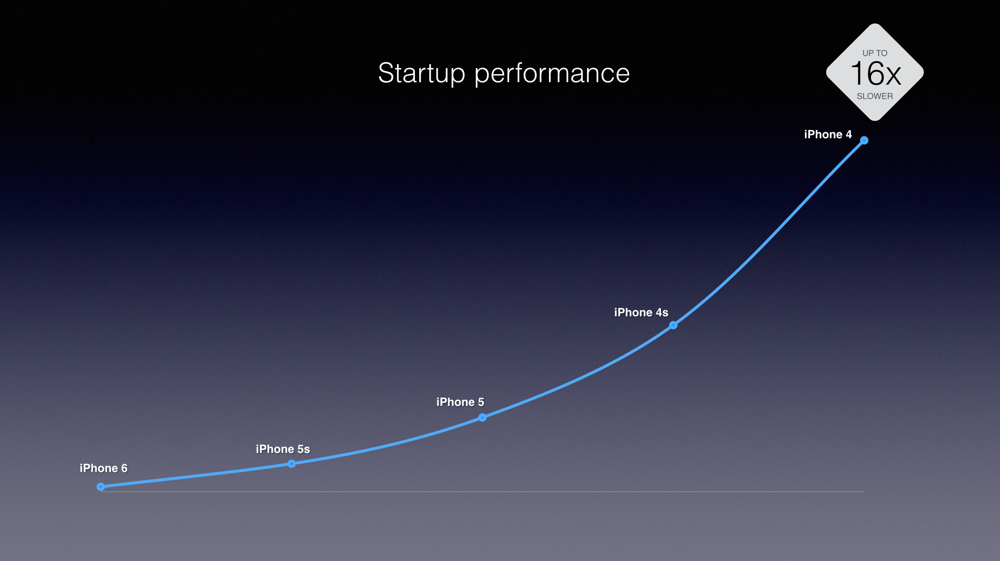
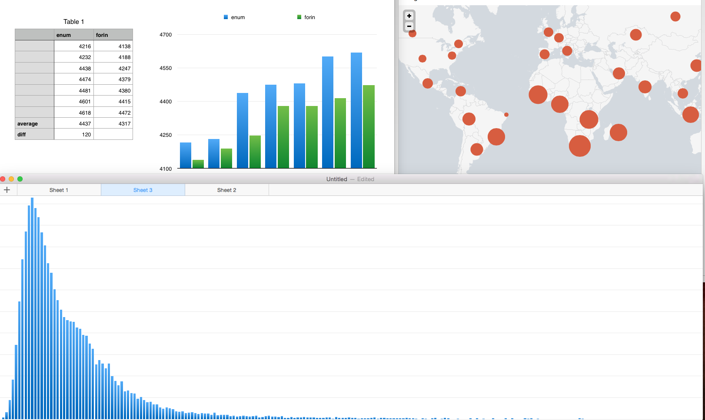
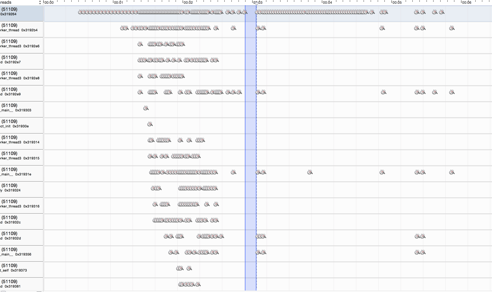
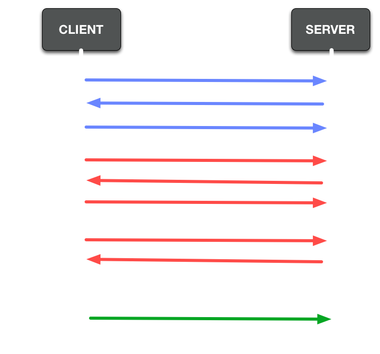
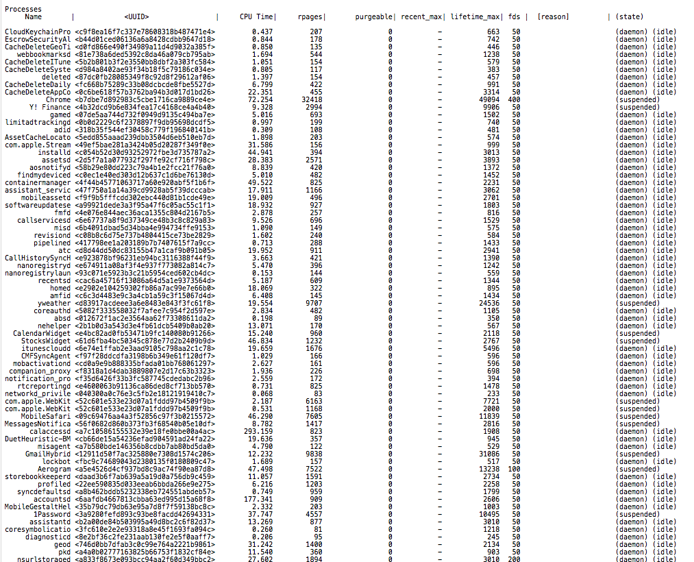

<!-- footer: @dbgrandi -->


# Coldstart

---

## The time between the tap and a usable app

---

## Who cares?

### Marketing People and Users

---

### Apps can be a magical experience, but you can screw that up real fast.

---


## What do you measure?

### This is strictly up for negotiation and interpretation.

---

### :point_up: ➔ UI with fresh data

---

1. :point_up:
1. Binaries & Obj-C Runtime
1. `+load()`
1. `main()`
1. `+init()`
1. `applicationDidFinishLaunching:`

---

### `main()` ➔ UI with fresh data

---

## Know your users
#### What devices do they use?
#### Where are they?

---


---



---


### What I thought my job would be

---



### Actual Job

---

## Learn Enough Stats to be Dangerous

---


---

## Properly measuring

---


```objc
    // No, no, no
    NSDate *startTime = [NSDate date];
    
    // Yes
    CFTimeInterval startTime = CACurrentMediaTime();    

    // Also, yes
    uint64_t t_start = mach_absolute_time();
```

---

### My Most used Xcode snippet

```objc
    uint64_t t_start = mach_absolute_time();

    <# code #>

    uint64_t t_end = mach_absolute_time();
    mach_timebase_info_data_t t_info;
    mach_timebase_info(&t_info);
    double_t elapsed = (t_end - t_start) * t_info.numer / (t_info.denom * (double_t)1e6);

    static dispatch_once_t onceToken;
    dispatch_once(&onceToken, ^{
      NSString *elapsedTimeString = [NSString stringWithFormat:@"%fms", elapsed];
      [[[UIAlertView alloc] initWithTitle:@"timer"
                                  message:elapsedTimeString
                                 delegate:nil
                        cancelButtonTitle:@"OK"
                        otherButtonTitles:nil] show];
    });
```

---

### Don't measure these

1. LLDB interaction
1. Safari interaction
1. Streaming logs to Xcode
1. iTunes

---

# How do we improve it?

---

### The Scientific Method

1. Ask a Question
1. Form a Hypothesis
1. Make a Fair Test
1. Analyze
1. Karaoke

---


## Instruments finds questions

---

#### Micro optimizations

---

### `for(Foo *f in bars)`
### not
### `enumerateObjectsWithBlock:`

---

### Use an `NSDictionary` instead
### of `config.json` where appropriate

---

### Swizzling is slow

---

### `+load()` /  `+init()`

#### People put "clever" stuff there

---

# Macro optimizations

---

### Flatten UI

#### Above the fold

---

### 1 Network Request

---

## Defer

---

I will not rate your app in the first 500ms

I will not use your sidebar before the UI appears

Your animation is in my way

---


## Concurrence

---

```objc
- (void)setupSomeSDK {
  NSAssert([NSThread isMainThread], @"This must be called from main thread.");
  
  // ...
}
```

### `NSBundle`, I'm looking at you

---

## Decompose


---

### My First `UITableViewController`

```objc
- (void)viewWillAppear {
  TeamsDataSource *dataSource = (TeamsDataSource *)self.dataSource;
  [dataSource fetchTeams:^(NSArray *things, NSError *error) {
    [self reloadTable];
  }];
}
```

---

## The CPU will get bored



---

### Decompose that ViewController

```objc

  // In your appDelegate, as early as possible
  TeamsDataSource *dataSource = [[TeamsDataSource alloc] initAndFetch];

  // Lots of other code...
  
  // When you get to the UI
  TeamsViewController *vc = [[TeamsViewController] initWithDataSource:dataSource];
```

---

### Reality...

```objc
  [self initCoreDataSlowly];

  // In your appDelegate, as early as possible
  TeamsDataSource *dataSource = [[TeamsDataSource alloc] initAndFetch];

  // ...
    
  // When you get to the UI
  TeamsViewController *vc = [[TeamsViewController] initWithDataSource:dataSource];
```


---

## Work around the latency

```objc
  // Even earlier... fetch and parse some JSON, don't CoreData it.
  TeamsFetchRequest *teamsRequest = [TeamsClient fetchTeams];
  
  [self initCoreDataSlowly];
  
  // Still way before the UI
  TeamsDataSource *dataSource = [[TeamsDataSource alloc] initWithFetchRequest:teamsRequest];

  // ...
    
  // When you get to the UI
  TeamsViewController *vc = [[TeamsViewController] initWithDataSource:dataSource];
```

---

### Keep breaking down the latency

```objc
  // This will make an HTTP request.
  //
  // Dependencies:
  // - DNS
  // - TCP handshake
  // - SSL handshake
  //
  TeamsFetchRequest *teamsRequest = [TeamsClient fetchTeams];
```

---

### DNS

```
$ dig api.yourapp.com

;; QUESTION SECTION:
;api.yourapp.com.		IN	A

;; ANSWER SECTION:
api.yourapp.com.	3600	IN	CNAME	yourapp.us-east-1.elb.amazonaws.com.
yourapp.us-east-1.elb.amazonaws.com. 60 IN A 54.233.61.10
yourapp.us-east-1.elb.amazonaws.com. 60 IN A 54.143.221.204
```

---

### DNS

```
$ dig api.yourapp.com

;; QUESTION SECTION:
;api.yourapp.com.		IN	A

;; ANSWER SECTION:
api.yourapp.com.	3600	IN	CNAME	yourapp.us-east-1.elb.amazonaws.com.
yourapp.us-east-1.elb.amazonaws.com. 60 IN A 54.233.61.10
yourapp.us-east-1.elb.amazonaws.com. 60 IN A 54.143.221.204
```

#### Resolve the DNS with `getaddrinfo()` ASAP
---



---

### HTTP Keep-Alive a `HEAD` request

---

### In practice...

---

#### Cold start is not purely a client side issue

### Let your big iron do the lifting

#### Localize the API (`NSNumberFormatter`, `NSDateFormatter`)

---

## The day will come when...

---


---


---


---



# It's a computer

---

### Unfortunately, the best data comes from deploying.

---


---

### @dbgrandi


https://speakerdeck.com/dbgrandi/coldstart-in-ios

---

Images:

```
http://blog.indieflix.com/wp-content/uploads/2013/09/tip_of_the_iceberg.jpg
https://farm6.staticflickr.com/5170/5249841186_3fabc6a12c_o.jpg
http://www.long-island-mac-tech.com/wp-content/plugins/RSSPoster_PRO/cache/c0b48_iphone_5s_a7_cpu_40x_slide.jpg
https://www.badgermapping.com/blog/wp-content/uploads/2014/07/the-matrix-online-wallpaper-HD-.jpg
http://upload.wikimedia.org/wikipedia/en/4/4c/Apple_Instruments_Icon.png
http://upload.wikimedia.org/wikipedia/commons/4/41/Sydney_Harbour_Bridge_lane_markers.jpg
https://farm6.staticflickr.com/5170/5249841186_3fabc6a12c_o.jpg
http://media.giphy.com/media/GG65KxQQdwDPW/giphy.gif
http://theproseandcons.com/wp-content/uploads/2015/01/screen-shot-2013-07-26-at-9-43-38-am.png
http://www.spaceweather.com/images2015/05apr15/cme_anim.gif?PHPSESSID=omr8b5h2on8v2bvhsnl7ua1ue5
http://ilovehdwallpapers.com/wallpapers/nike-blue-color-logo-1920x1080.jpg
```